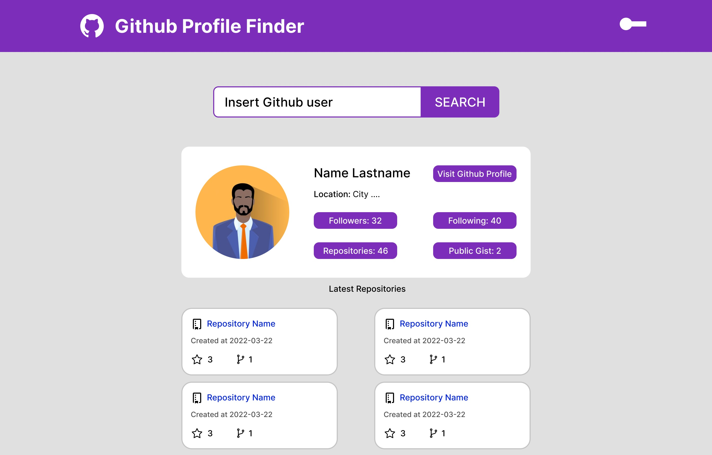

<h1 align="center">  Github Profiles Finder 🔎</h1>

Simple page to search for github profiles and return their infos.
Developed with ReactJS using Github API.
Idea taken from <a href="https://github.com/florinpop17/app-ideas" target="_blank">App Ideas Collection</a>

<h3><a  href="https://wg-github-profiles-finder.vercel.app/"  target="_blank">🚀 See and test here </a></h3>

## ⚙️ Functionalities
-   [x] User can enter a username
-   [x] User can click on search button to retrieve information
-   [x] User can see the avatar, username, followers and repository count of searched user
-   [x] User can see the top 4 repositories of searched user
-   [X] User should get an alert if the username is not valid

<h3 align="center">Bonus features</h3>

-  [x] User can toggle dark/light mode
-  [x] Selected mode should persist when user comes back to the app again

## 💻 Technologies
- ReactJS 
- GithubAPI 
- Bootstrap

## 🎨 Layout
The layout of application is available on Figma:

## 🦸‍♂️ Author
<a href="https://williamgrohe.github.io/">
 
  
 <b>William Grohe</b></a> <a href="https://williamgrohe.github.io/" title="Author">🚀</a>
 
 

Made with ❤️ by William Grohe.
